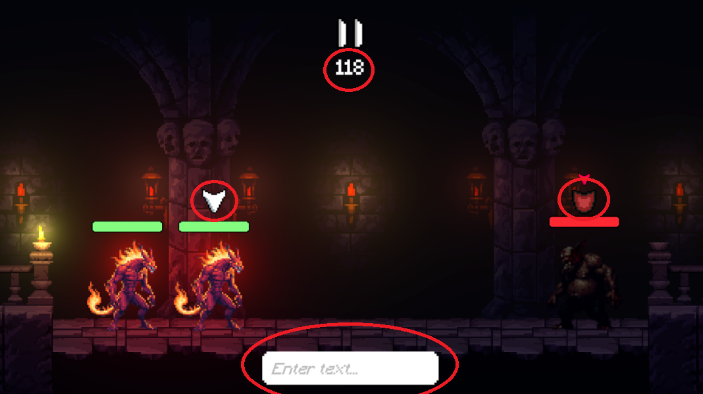

# NEW WEBSITE
https://spaziergaeng.itch.io/shadows-bane

# Shadows Bane - Banish the Night (English Version)

## Table of Contents
In this ReadMe, you will find information about our game, divided into the following sections:

1. [About the project "Shadows Bane"](#project-shadows-bane)
2. [The game](#game)
3. [Gameplay](#gameplay)
4. [Installation of the game](#installation)
5. [Found a bug?](#bug-reporting)
6. [Contributors](#contributors)

---

## Project Shadows Bane
*Shadows Bane* is a turn-based Dark Fantasy game where the player controls light creatures to fight dark shadow beings. This game is the result of our university course *Game Project*.  

In the development process, the theme **"Living Light"** had to be integrated into the game, along with a new technology. The implementation of the theme will be discussed in the section [The game](#game), while the chosen technology in our case is AI-based control through natural language input (NLP).

Since the game is still under development, there is currently only a demo version with 2-3 battles, including a boss fight and a tutorial. More features and additional battles will be added as the development progresses.

---

## The Game
## 🎥 Trailer:

The theme is realized as follows: The map starts off dark, and the protagonist—a knight—fights his way through the map. With each victorious battle, light spreads across the map, unlocking new battles for the knight to conquer.  

The goal is to unlock the entire map and win every battle to finally banish the darkness.

The knight is accompanied by two allies who are controlled via text input. The AI interprets the input and selects a move that matches the given command. Each ally reacts differently, so you need to discover how to guide them most effectively.

Currently, there are six possible moves for the AI to choose from: **Heavy Attack, Light Attack, Dodge, Defend, Heal, and Communicate**. 

---

## Gameplay 
*At the bottom, you will find the text input that is processed by the AI. You can switch between allies using the TAB key. You have 120 seconds to enter your text command. You can also see a symbol above the enemy as a hint for his next move.*

*In each room, the brightness on the enemy’s side (right) is initially weaker. After winning the battle, the room becomes fully illuminated, reflecting the theme's concept.*

*After winning battles, you will receive keys that allow you to unlock new rooms. Once you collect all keys, the boss fight will be unlocked.*

---

## Installation 
To install the game, follow these steps:

1. Download the folder from the following link as a `.zip` file. (Link: https://drive.google.com/file/d/1gFBVT2jaRJdhpwdG2bQf11i83HfX6GNP/view?usp=drive_link)
2. Extract the archive on your PC.
3. Inside, you should find an `.exe` file. Run it to start the game.

*Disclaimer: The game is currently only available for Windows and an active internet connection is required for the game.*

---

## Bug Reporting
Since this is still a demo version, it is quite possible that there are some bugs.  

If you find any, feel free to let us know!  
Create an issue, describe the bug, and, if possible, attach screenshots. We will review it as soon as possible. Thank you!

---

## Contributors 

### Core Gameplay 
- Berat-Yasin Bahadir 
- Davide Deho
- Suthan Sivendran 

### Art (UI, Icons)
- Eduard Ajupi
- Urim Krasniqi
- Ermal Balaj

### Character Design/Animation
- Leys Köksal
- Ermal Balaj
- Schahad Al-Beik

### Testing
- Batuhan Özdamar
- Leys Köksal
- Nikolas Koch
- Jason Dietrich

### NLP
- Nikolas Koch
- Jason Dietrich

### 3D Assets, Map Design
- Berat-Yasin Bahadir 
- Davide Deho
- Suthan Sivendran
- Eduard Ajupi
- Urim Krasniqi
- Batuhan Özdamar
- Leys Köksal
- Schahad Al-Beik

---

# Shadows Bane - Banish the Night (Deutsch)

## Table of Contents
In dieser ReadMe wirst du Informationen zu unserem Spiel bekommen, unterteilt in folgende Unterpunkte:

1. [About the project "Shadows Bane"](#project-shadows-bane)
2. [The game](#game)
3. [Gameplay](#gameplay)
4. [Installation of the game](#installation)
5. [Found a bug?](#bug-reporting)
6. [Contributors ](#contributors)

---

## Project Shadows Bane
Shadows Bane ist ein rundenbasiertes Dark-Fantasy-Spiel, in dem der Spieler Lichtkreaturen gegen finstere Schattenwesen steuert. Das Game ist das Ergebnis unseres Kurses "Spielprojekt" von unserer Universität. 

In der Spielentwicklung musste man das Theme **"Living light"** berücksichtigen und dazu noch eine neue Technologie in das Spiel einbauen. Ersteres wird im nachfolgenden Punkt  [The game](#game) besprochen. Die neue Technologie ist in unserem Fall eine KI-basierte Steuerung über natürliche Spracheingaben (NLP).

Da das Spiel noch nicht fertiggestellt ist, gibt es derzeit nur eine Demo mit 2-3 Kämpfen inklusive Boss-Fight und Tutorial. Bis zur fertigstellung werden noch weitere Features folgen und natürlich auch mehr Kämpfe.

---

## Game

## 🎥 Trailer:

Das Theme wurde folgendermaßen realisiert: Zum einen wird die Map am Anfang eher Dunkel sein und der Protagonist (bei uns ein Ritter) wird sich durch die Map kämpfen und durch gewonnene Kämpfe das Licht in der Map verbreiten. Dadurch schaltet man neue Kämpfe in der Map frei, die der Ritter wieder bestreiten kann. 

Das Ziel ist es die ganze Map freizuschalten und jeden der Kämpfe anschließend zu gewinnen, sodass die Map am Ende auch von der Dunkelheit befreit ist. 

Der Ritter wird seine Kämpfe mit 2 Allies bestreiten die er durch den eingegebenen Textprompt steuern kann. Dabei wird der eingegebene Prompt von der KI interpretiert und diese sucht dann einen Move aus der zum Prompt passt. Man muss dabei beachten das jeder Ally von dir anders reagiert – finde heraus, wie du sie am besten lenken kannst.

Es gibt derzeit 6 Moves für die sich die KI entscheiden kann: **Heavy Attack, Light Attack, Dodge, Defend, Heal, Communicate**. Abhängig von deiner Text Eingabe wird die KI einen der 6 Moves auswählen und dein jeweiliger Ally vollzieht diesen Move dann.

---

## Gameplay 
*In der unteren Leiste sieht man die Text-Eingabe die von der KI bearbeitet wird. Mit der TAB Taste kann man zwischen den Allies switchen, außerdem hat man 120 Sek Zeit für die Text Eingabe. Man sieht auch ein Symbol über den Feind der als Tipp dient für seinen nächsten Move.*

*In den Räumen ist die Helligkeit auf der Seite des Feindes (rechts) schwächer, erst nach einem gewonnenen Kampf leuchtet der Raum einheitlich. Dies trägt zur Realisierung des Themes bei.*

*Nach gewonnenen Kämpfen kriegt man Schlüssel mit denen man neue Räume betreten kann. Hat man alle Schlüssel kann man den Boss Fight freischalten.*

---

## Installation 
Zum Installieren des Spiels sollt ihr folgendes machen:

1. Lade den Ordner vom folgenden Link als `.zip` Datei herunter. (Link: https://drive.google.com/file/d/1gFBVT2jaRJdhpwdG2bQf11i83HfX6GNP/view?usp=drive_link)
2. Entpacke das Archiv auf deinem PC.
3. Darin sollte eine `.exe` Datei sein, wenn ihr diese ausführt startet das Spiel.

*Hinweis: Das Spiel ist bisher nur für Windows verfügbar und man braucht eine bestehende Internetverbindung für das Spiel.*

## Bug-Reporting
Da das Spiel noch eine Demo ist, ist es relativ wahrscheinlich das sich irgendwo Bugs verstecken.

Falls ihr welche gefunden habt, könnt ihr uns es gerne wissen lassen!

Erstellt dafür ein Issue und beschreibt den Bug darin und fügt falls möglich Screenshots ein. Wir werden uns diese dann angucken, Danke!

## Contributors 

### Core Gameplay 
- Berat-Yasin Bahadir 
- Davide Deho
- Suthan Sivendran 

### Art (UI, Icons)
- Eduard Ajupi
- Urim Krasniqi
- Ermal Balaj

### Character Design/Animation
- Leys Köksal
- Ermal Balaj
- Schahad Al-Beik

### Testing
- Batuhan Özdamar
- Leys Köksal
- Nikolas Koch
- Jason Dietrich

### NLP
- Nikolas Koch
- Jason Dietrich

### 3D Assets, Map Design
- Berat-Yasin Bahadir 
- Davide Deho
- Suthan Sivendran
- Eduard Ajupi
- Urim Krasniqi
- Batuhan Özdamar
- Leys Köksal
- Schahad Al-Beik
