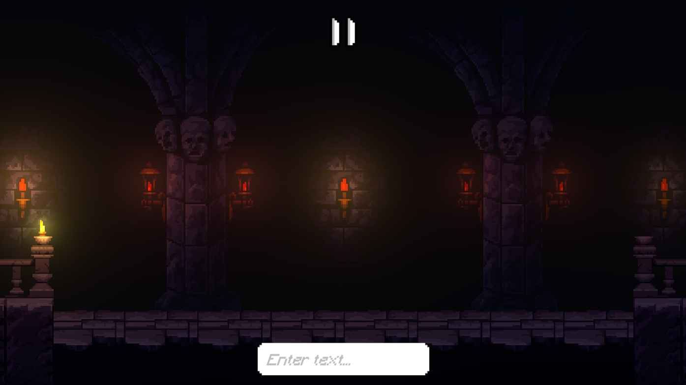
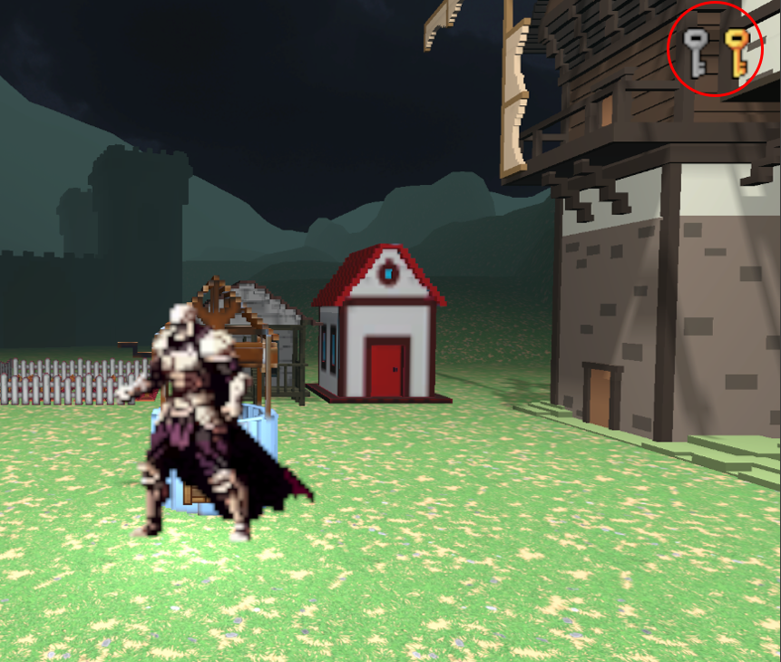

# Shadows Bane - Banish the Night

## Table of Contents
In dieser ReadMe wirst du Informationen zu unserem Spiel bekommen, unterteilt in folgende Unterpunkte:

1. [About the project "Shadows Bane"](#project-shadows-bane)
2. [The game](#game)
3. [Gameplay](#gameplay)
4. [Installation of the game](#installation)
5. [Found a bug?](#bug-reporting)
6. [Contributors ](#contributors)

---

## Project Shadows Bane
Shadows Bane ist ein rundenbasiertes Dark-Fantasy-Spiel, in dem der Spieler Lichtkreaturen gegen finstere Schattenwesen steuert. Das Game ist das Ergebnis unseres Kurses "Spielprojekt" von unserer Universität. 

In der Spielentwicklung musste man das Theme "Living light" berücksichtigen und dazu noch eine neue Technologie in das Spiel einbauen. Ersteres wird im nachfolgenden Punkt "Game" besprochen. Die neue Technologie ist in unserem Fall eine KI-basierte Steuerung über natürliche Spracheingaben (NLP).

Da das Spiel noch nicht fertiggestellt ist, gibt es derzeit nur eine Demo mit 2-3 Kämpfen inklusive Boss-Fight und Tutorial. Bis zur fertigstellung werden noch weitere Features folgen und natürlich auch mehr Kämpfe.

---

## Game
Das Theme wurde folgendermaßen realisiert: Zum einen wird die Map am Anfang eher Dunkel sein und der Protagonist (bei uns ein Ritter) wird sich durch die Map kämpfen und durch gewonnene Kämpfe das Licht in der Map verbreiten. Dadurch schaltet man neue Kämpfe in der Map frei, die der Ritter wieder bestreiten kann. 

Das Ziel ist es die ganze Map freizuschalten und jeden der Kämpfe anschließend zu gewinnen, sodass die Map am Ende auch von der Dunkelheit befreit ist. 

Der Ritter wird seine Kämpfe mit 2 Allies bestreiten die er durch den eingegebenen Textprompt steuern kann. Dabei wird der eingegebene Prompt von der KI interpretiert und diese sucht dann einen Move aus der zum Prompt passt. Man muss dabei beachten das jeder Ally von dir anders reagiert – finde heraus, wie du sie am besten lenken kannst.

Es gibt derzeit 6 Moves für die sich die KI entscheiden kann, Heavy Attack, Light Attack, Dodge, Defend, Heal und Communicate. Abhängig von deiner Text Eingabe wird die KI einen der 6 Moves auswählen und dein jeweiliger Ally vollzieht diesen Move dann.

---

## Gameplay 
*In der unteren Leiste sieht man die Text-Eingabe die von der KI bearbeitet wird. Mit der TAB Taste kann man zwischen den Allies switchen, außerdem hat man 120 Sek Zeit für die Text Eingabe.*

*In den Räumen ist die Helligkeit auf der Seite des Feindes (rechts) schwächer, erst nach einem gewonnenen Kampf leuchtet der Raum einheitlich. Dies trägt zur Realisierung des Themes bei.*

*Nach gewonnenen Kämpfen kriegt man Schlüssel mit denen man neue Räume betreten kann. Hat man alle Schlüssel kann man den Boss Fight freischalten.*

---

## Installation 
Zum Installieren des Spiels sollt ihr folgendes machen:

1. Lade die Ordner dieses Repository als .zip-Datei herunter.
2. Entpacke das Archiv auf deinem PC.
3. Darin sollte eine exe. Datei sein, wenn ihr diese ausführt dann startet das Spiel.

## Bug-Reporting
Da das Spiel noch eine Demo ist, ist es relativ wahrscheinlich das sich irgendwo Bugs verstecken.

Falls ihr welche gefunden habt, könnt ihr uns es gerne wissen lassen!

Erstellt dafür ein Issue und beschreibt den Bug darin und fügt falls möglich Screenshots ein. Wir werden uns diese dann angucken, Danke!

## Contributors 

### Core Gameplay 
- Berat-Yasin Bahadir 
- Davide Deho
- Suthan Sivendran 

### Art (UI, Icons)
- Eduard Ajupi
- Urim Krasniqi
- Ermal Balaj

### Character Design/Animation
- Leys Köksal
- Ermal Balaj
- Schahad 

### Testing
- Batuhan Özdamar
- Leys Köksal
- Nikolas Koch
- Jason Dietrich

### NLP
- Nikolas Koch
- Jason Dietrich

### 3D Assets, Map Design
- Berat-Yasin Bahadir 
- Davide Deho
- Suthan Sivendran
- Eduard Ajupi
- Urim Krasniqi
- Batuhan Özdamar
- Leys Köksal
- Schahad
